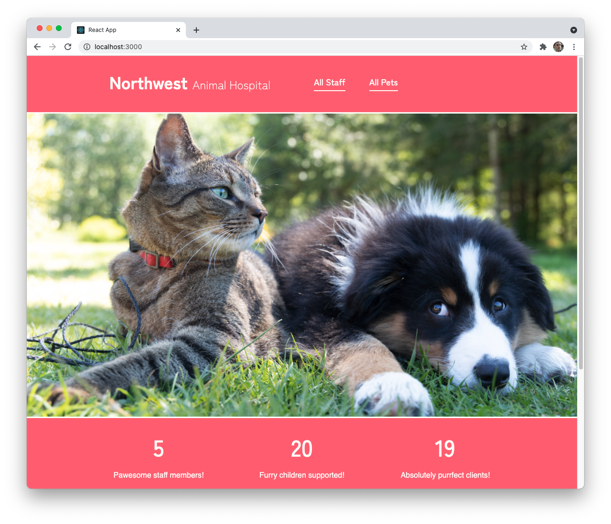
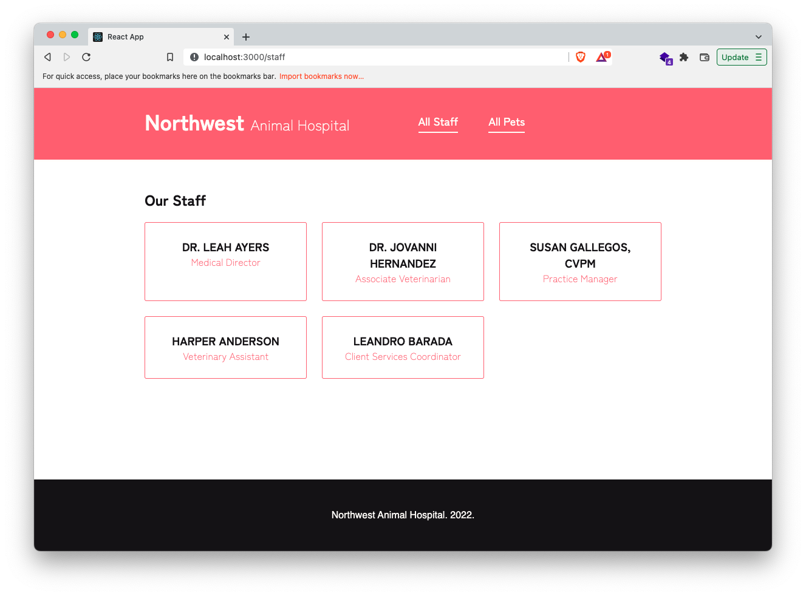
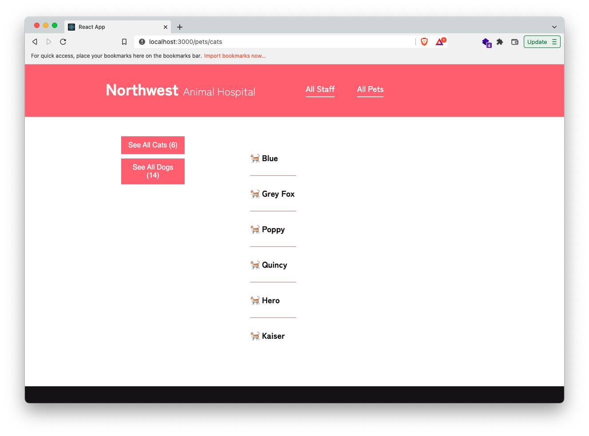
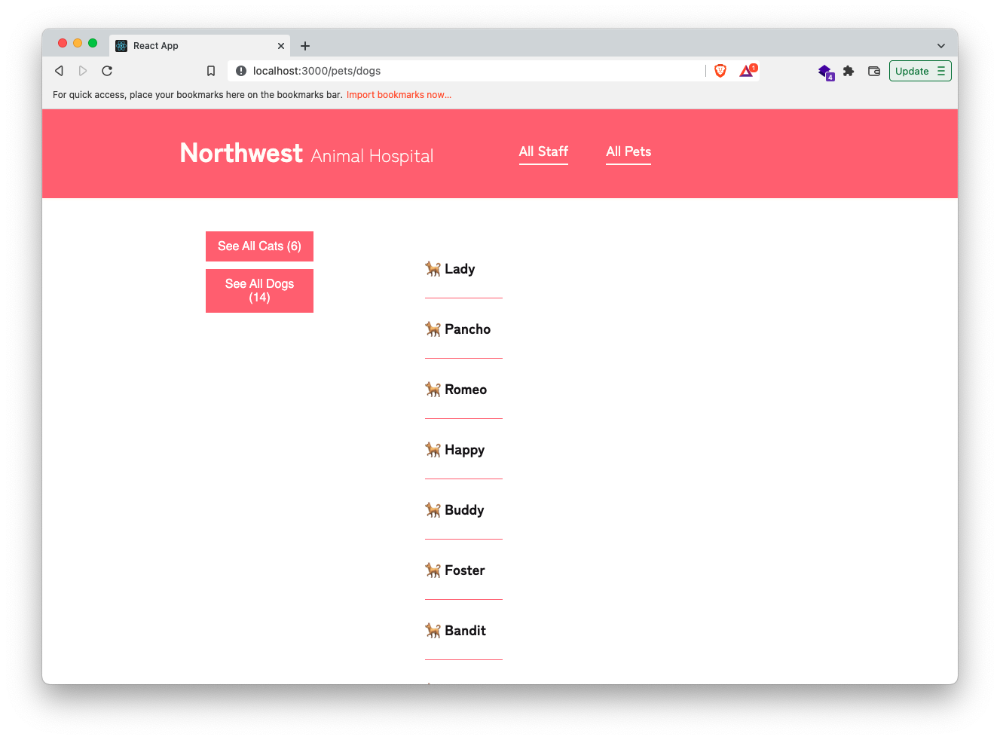

# React Routing Lab

In this lab you will add routing to an animal hospital's website using React Router.



---

## Lab Setup

### Getting started

1. Fork and clone this repository.

1. Navigate to the cloned repository's directory on your command line. Then, run the following command:

   ```
   npm install
   ```

   This will install the libraries needed to run the tests.

1. Open up the repository in VSCode. Follow the instructions below to complete the Lab.

### Tests

To run the tests, you can run the following command from the command line. You will need to be in the root directory of your local directory.

```
npm test
```

This will open the Cypress testing window, where you can click to run an individual suite of tests or all of the tests at once.

#### Testing Tips

Keep the following in mind for this lab as you run the tests.

1. While running your tests, you must have a server up and running in another terminal. This means you will have _both_ a terminal window running the actual React application _and_ a terminal window running the tests.

1. When creating a component, make sure to create and import it with the same name as the file name. For example, the component created and exported inside of the `NavBar.js` file should be `NavBar`. The tests look for these specific names.

1. While the `cypress-watch-and-reload` package has been installed in this project, sometimes the React application will take longer to reload than the tests. If you feel as though a test should be passing that isn't, try pressing the re-run button in the Cypress tests before asking for help.

## Instructions

The general functionality of the page already exists. Unfortunately, the contents of three different pages are all dumped on the main page!

You will need to add routing for the page. To complete this lab, you will need to create the following routes:

- `/`: When going to the index, you should see the `Home` component, alongside the `Nav` and `Footer`. [✓]
- `/staff`: When going to the Staff page route, you should see the `StaffList` component, alongside the `Nav` and `Footer`. [✓]
- `/pets`: When going to the Pets page route, you should be redirected to `/pets/cats`.[✓]
  - `/pets/cats`: When going to the Cats page route, you should see the `PetsList` component, alongside the `Nav` and `Footer`. You should only be shown cats.[✓]
  - `/pets/dogs`: When going to the Dogs page route, you should see the `PetsList` component, alongside the `Nav` and `Footer`. You should only be shown dogs.[✓]

Additionally, the following links and buttons should have some effects.

- The `Nav` contains three links. Update the links so that they work with React router.[✓]
  - `Northwest Animal Hospital` - should link to `/`[✓]
  - `All Staff` - should link to `/staff`[✓]
  - `All Pets` - should link to `/pets`[✓]
- The `PetsList` contains two links: "See All Cats" and "See All Dogs". Clicking either link should send the person to the appropriate route and change the displayed list.[✓]

By doing the above, all of the tests should pass as opposed to just a few.

### Data for this lab

There are no API calls in this Lab. This is so that you can focus on routing as opposed to networking.

All of the data is contained inside of the `src/data` folder and is imported inside of `App.js`.

### Views

`/staff`



`/cats`



`/dogs`



### Tips

The following tips may help you as you're working on this project:

- Remember that you will need to import React Router-specific elements by importing from `"react-router-dom"`.
- Remember that `a` elements should not be used with React Router. Instead, use [`Link` components](https://reactrouter.com/web/api/Link).
- The `/pets` page allows for a _nested view._ The sidebar with the links to see all cats and dogs should remain on the page while the inner piece of the page should change depending on the route.
- Use [the documentation](https://reactrouter.com/docs/en/v6/getting-started/tutorial)
- Look into [wildcards](https://reactrouter.com/docs/en/v6/upgrading/v5#note-on-route-path-patterns) for the nested cat and dog routes

---

Photo by <a href="https://unsplash.com/@sita2?utm_source=unsplash&utm_medium=referral&utm_content=creditCopyText">Andrew S</a> on <a href="https://unsplash.com/s/photos/pets?utm_source=unsplash&utm_medium=referral&utm_content=creditCopyText">Unsplash</a>

### Stretch

- Work on styling

  - Create a sticky footer: No matter the height of the rest of the elements the footer is always, at minimum, at the bottom or below.
  - Make the pages responsive

- Make a 404 page

  - if someone goes to`/pets/birds` it goes to a custom `Not Found` view

- Create a new page `New Pet` - that has a form that will allow you to add a new pet and see it appear in one of the lists

- Create a new pagew `New Staff` that has a form that will allow you to add a new staff memeber and see it appear in the staff list

- Make pages and views for owners (look at the `data` in the `data` folder in `/src`)

- Allow sorting of dog/cats by name or breed
